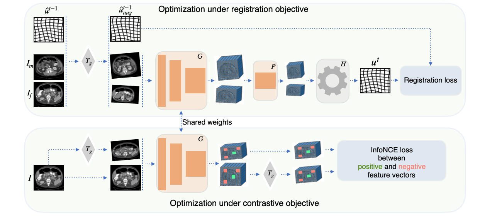
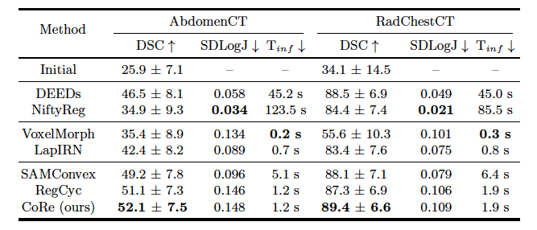

# CoRe: Joint Optimization with Contrastive Learning for Medical Image Registration

## Overview

This repository contains the code and resources for the for joint optimization with
**Co**ntrastive learning for medical image **Re**gistration (CoRe). CoRe integrates
contrastive learning directly into the registration pipeline, enhancing the robustness of extracted
features to anatomical variations and improving the overall reliability of the framework.



We evaluate the proposed approach on abdominal and thoracic anatomical
regions in both intra-patient and inter-patient registration settings, achieving
superior performance compared to competitive approaches.



## Installation

To install the necessary dependencies, run the following command:

```bash
pip install -r requirements.txt
```

## Usage

To use this project, follow these steps:

1. Set desirable settings in the file `main.py`.
2. Run `main.py`.
